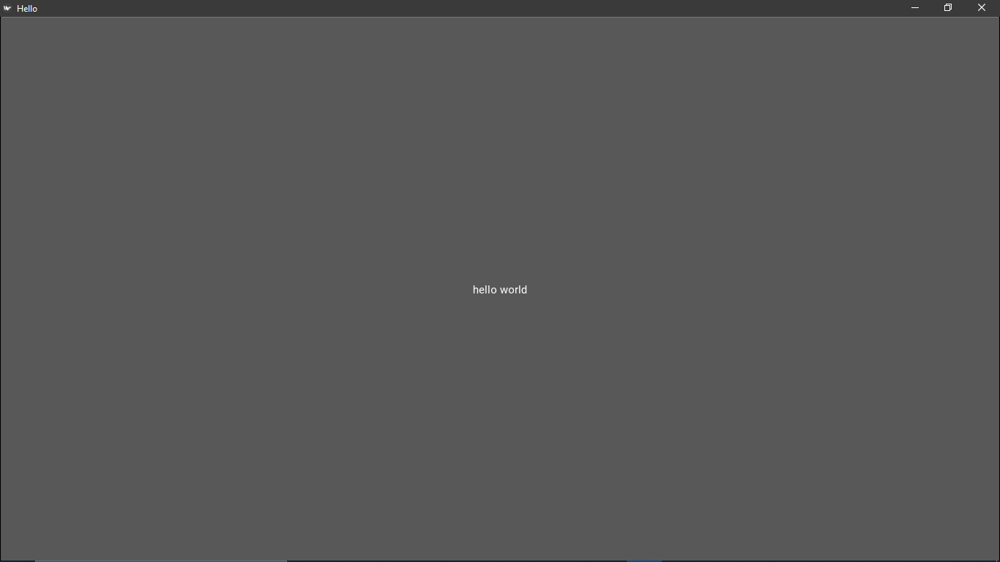
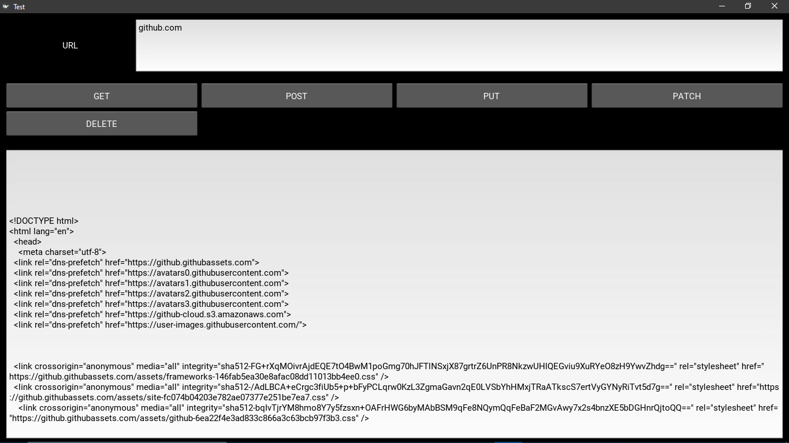
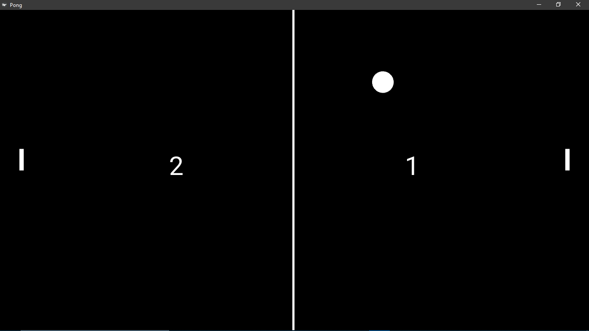
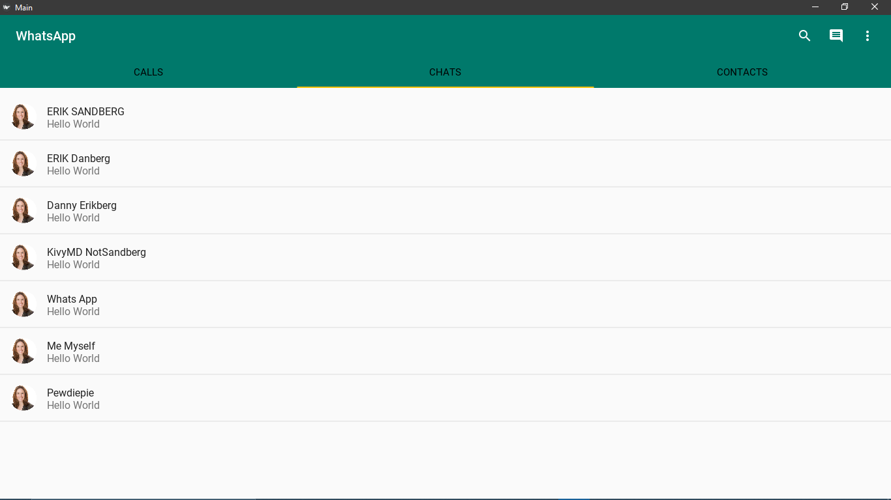

# Learn Kivy
Website: https://kivy.org

Learning: https://kivy.org/doc/stable/gettingstarted/intro.html

API reference docs: https://kivy.org/doc/stable/api-kivy.html

Material Design with KivyMD: https://github.com/HeaTTheatR/KivyMD

Learn KivyMD: https://www.youtube.com/playlist?list=PLy5hjmUzdc0nMkzhphsqgPCX62NFhkell


## Project Installation:
### 1. Building yourself
- First ensure you have python 3.5+ installed in your system. If not donwload and install from [Python.org website](https://python.org/downloads)

#### Go to the terminal and run:
```
$ git clone https://github.com/hemanta212/kivy_apps.git
$ cd kivy_apps
$ python -m venv .venv 

# For windows:
  $ .venv\Scripts\activate
# For linux:
  $ source .venv\bin\activate

$ python -m pip install -r requirements.txt
```

##### NOTE
If you encounter some problems. Look if kivy is properly installed:
* [Kivy Installation For Windows](https://kivy.org/doc/stable/installation/installation-windows.html)
* [Kivy Installation For linux](https://kivy.org/doc/stable/installation/installation-linux.html)

#### For each project you can navigate to folder and run
```
$ python main.py
```

### 2. Try out in android!
#### Install apks from release
Go to the [release](https://github.com/hemanta212/kivy_apps/releases/latest) and donwload and install apks.
The apks are unsigned. You can download zipsigner app from playstore to sign these apks and install yourself.

#### Run in Kivy Launcher app
Download the [Kivy Launcher](https://play.google.com/store/apps/details?id=org.kivy.pygame&hl=en_US) app from play store.
Download the zip file of this project in your android and extract its contents in <internal storage>/kivy folder : [Download project zip link](https://github.com/hemanta212/kivy_apps/archive/master.zip)

Here is the documentation on how to use this app. [Docs LINK](https://kivy.org/doc/stable/guide/packaging-android.html#packaging-your-application-for-the-kivy-launcher). You just need to move each project in to your sdcard/kivy folder. Thats it.

## Projects:
1. Hello world
2. Http requester
3. Pong game
4. Whatsapp like UI using kivyMD

  
